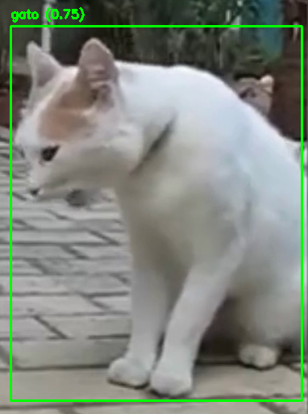

  
# 🐱 Projeto CatVision  
Projeto criado para a disciplina **Fundamentos de Inteligência Artificial (FIA)** - Graduação. **Professor:** Pablo De Chiaro

**Este projeto utiliza Visão Computacional para detectar gatos, configurando um ambiente Python com as bibliotecas necessárias para processar e analisar imagens.**

**O CatVision utiliza o OpenCV para processamento de imagens e TensorFlow para inferência. Ele implementa uma detecção baseada em características de gatos, demonstrando conceitos de Visão Computacional aplicados a um cenário real.**

## 👩‍🎓 **Discentes:**  
- Carolina Freitas  
- Júlia Hallal  

# 🛠️ **Configuração do Ambiente Virtual**  
1. **Criar o ambiente virtual:**  

   ```bash  
   python -m venv env-visao  
   ```

2. **Ativar o ambiente virtual:**

   No macOS e Linux:

   ```bash
   source ./env-visao/bin/activate
   ```

   No Windows:

   ```bash
   .\env-visao\Scripts\activate
   ```

## 📥 Instalação de Dependências
Certifique-se de que seu ambiente virtual esteja ativado. Instale as dependências listadas no arquivo `requirements.txt`:

```bash
pip install -r requirements.txt
```

### Conteúdo do arquivo `requirements.txt`:
```text
numpy==2.0.0
opencv-python==4.10.0.84
tensorflow==2.18.0
```

# 🚀 Rodar o Script
``python cat_vision.py``

## Desativação do Ambiente Virtual
```bash
deactivate
```
